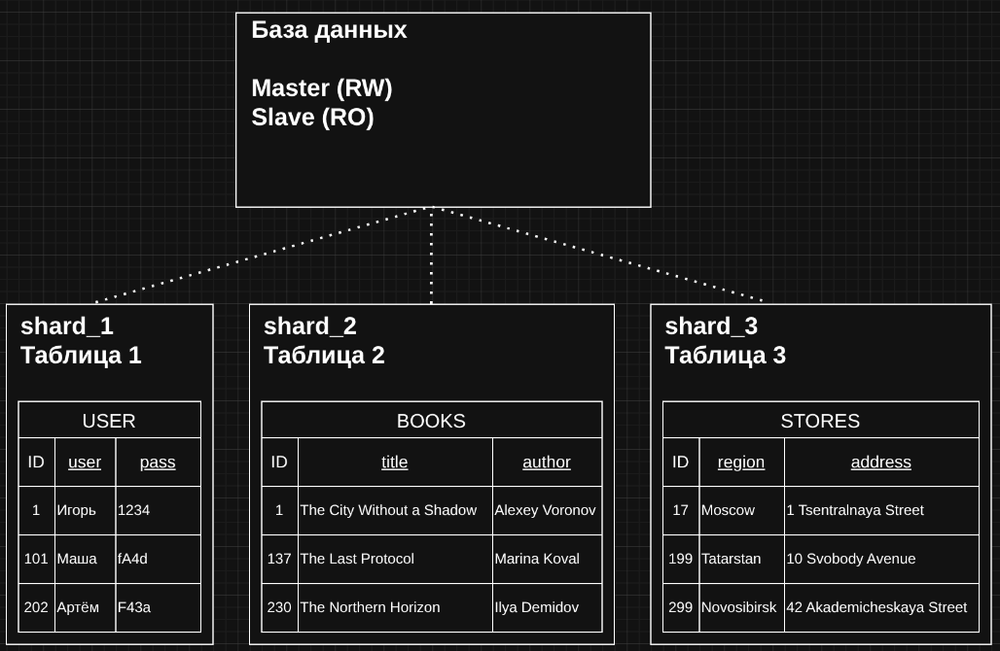

# Домашнее задание к занятию 7 "`Репликация и масштабирование. Часть 2`" - `Заяц Алексей`

### Инструкция по выполнению домашнего задания

   1. Сделайте `fork` данного репозитория к себе в Github и переименуйте его по названию или номеру занятия, например, https://github.com/имя-вашего-репозитория/git-hw или  https://github.com/имя-вашего-репозитория/7-1-ansible-hw).
   2. Выполните клонирование данного репозитория к себе на ПК с помощью команды `git clone`.
   3. Выполните домашнее задание и заполните у себя локально этот файл README.md:
      - впишите вверху название занятия и вашу фамилию и имя
      - в каждом задании добавьте решение в требуемом виде (текст/код/скриншоты/ссылка)
      - для корректного добавления скриншотов воспользуйтесь [инструкцией "Как вставить скриншот в шаблон с решением](https://github.com/netology-code/sys-pattern-homework/blob/main/screen-instruction.md)
      - при оформлении используйте возможности языка разметки md (коротко об этом можно посмотреть в [инструкции  по MarkDown](https://github.com/netology-code/sys-pattern-homework/blob/main/md-instruction.md))
   4. После завершения работы над домашним заданием сделайте коммит (`git commit -m "comment"`) и отправьте его на Github (`git push origin`);
   5. Для проверки домашнего задания преподавателем в личном кабинете прикрепите и отправьте ссылку на решение в виде md-файла в вашем Github.
   6. Любые вопросы по выполнению заданий спрашивайте в чате учебной группы и/или в разделе “Вопросы по заданию” в личном кабинете.
   
Желаем успехов в выполнении домашнего задания!

---

### Задание 1

Опишите основные преимущества использования масштабирования методами:

* активный master-сервер и пассивный репликационный slave-сервер;
* master-сервер и несколько slave-серверов;

*Дайте ответ в свободной форме.*

#### Решение:

**Активный master + пассивный репликационный slave:**
1. Настройка и сопровождение простая: активный master база пишет, репликационный slave принимает изменения.
2. Пасcивный репликационный slave может быть быстро повышен до master при падении основного, что снижает время простоя.
3. Реплику можно использовать для бэкапов и отчётов, чтобы не нагружать master.
4. Один репликатор — дешевле в содержании по сравнению с множеством узлов.

**Master + несколько slave-серверов:**
1. Несколько slave-серверов позволяют распределить большой поток чтений, резко повышая пропускную способность.
2. Потеря одного slave-сервера не нарушит обслуживания — другие продолжат работать.
3. Разместив реплики в разных регионах, снижаются задержки для локальных пользователей.
4. Можно обновлять slave-сервера по очереди и переключать трафик, минимизируя простои.

---

### Задание 2

Разработайте план для выполнения горизонтального и вертикального шаринга базы данных. База данных состоит из трёх таблиц:

* пользователи,
* книги,
* магазины (столбцы произвольно).

Опишите принципы построения системы и их разграничение или разбивку между базами данных.

*Пришлите блоксхему, где и что будет располагаться. Опишите, в каких режимах будут работать сервера.*

#### Решение:

**Вертикальный шардинг:**

Блоксхема:

Режимы работы: 

* **Master: read / write** - работает в режиме чтения и записи, является единственной точкой записи в базе данных.
* **Slave: read-only** - работает в режиме только чтения, используется для выполнения SELECT-запросов, отчётов и аналитики, снижая нагрузку на Master.

Вертикальный шардинг реализован внутри одной базы данных путём логического разделения данных по таблицам **users**, **books** и **stores**. Каждая таблица представляет отдельную бизнес-сущность и обрабатывается независимо с точки зрения логики приложения.

**Горизонтальный шардинг:**

Блоксхема:

Режимы работы: 

* **Master: read / write** - обрабатывает операции чтения и записи только для данных, относящихся к своему шарду.
* **Slave: read-only** - работает в режиме только чтения и используется для SELECT-запросов, аналитики и отчётов, снижая нагрузку на Master соответствующего шарда.

Горизонтальный шардинг реализован внутри одной базы данных путём разделения строк в таблицах **users**, **books** и **stores** по диапазонам идентификаторов (ID). Каждый шард содержит одинаковую структуру таблиц, но хранит только часть данных, относящихся к своему диапазону значений.